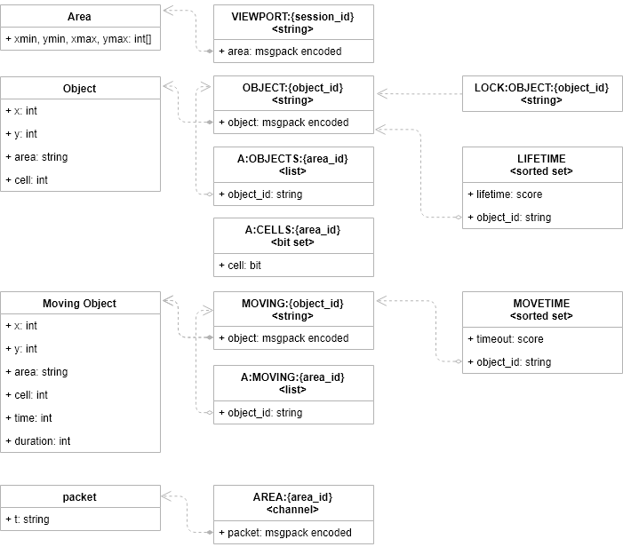

# Infinite Tiles API

[](https://travis-ci.org/akornatskyy/infinite-tiles-api-lua)

Infinite tiles API written using [lua](http://lua.org/) and
[lucid](https://github.com/akornatskyy/lucid) web API toolkit.

## Setup

Install dependencies into virtual environment:

```sh
make env nginx
eval "$(env/bin/luarocks path --bin)"
make test qa
```

## Run

Serve requests with a web server:

```sh
make run
```

## Redis Data Structures

The map is split into rectangular areas of a certain size (e.g. 4x8, 4 wide).
Each area has a fixed number of cells (e.g. 32). A cell can either be occupied
or not. If a cell is occupied it can't be used to place another object there.
An object once placed has a limited lifetime, in the range from 10 to 20
seconds and removed once the object lifetime expires.



### Strings

| Key Format              | Value                      | Notes                                                        |
| ----------------------- | -------------------------- | ------------------------------------------------------------ |
| VIEWPORT:{session_id}   | messagepack encoded object | The area meta information.                                   |
| OBJECT:{object_id}      | messagepack encoded object | The object meta information.                                 |
| LOCK:OBJECT:{object_id} | empty string               | The lock to exclusively operate with object, expires in 1 second. |
| MOVING:{object_id}      | messagepack encoded object | The moving object meta information.                          |

Area meta information.

| Field Name               | Field Type  | Notes                                                    |
| ------------------------ | ----------- | -------------------------------------------------------- |
| [xmin, ymin, xmax, ymax] | list of int | The area corner coordinates (left top and right bottom). |

Object meta information.

| Field Name | Field Type | Notes                     |
| ---------- | ---------- | ------------------------- |
| x          | int        | The tile x coordinate.    |
| y          | int        | The tile y coordinate.    |
| area       | string     | The reference to area id. |
| cell       | int        | The cell within area.     |

Moving object meta information.

| Field Name | Field Type | Notes                                              |
| ---------- | ---------- | -------------------------------------------------- |
| x          | int        | The tile x coordinate.                             |
| y          | int        | The tile y coordinate.                             |
| area       | string     | The reference to area id.                          |
| cell       | int        | The cell within area.                              |
| time       | float      | The unix timestamp when the move has been started. |
| duration   | float      | The duration in seconds for the move to complete.  |

### Lists

| Key Format          | Value             | Notes                                             |
| ------------------- | ----------------- | ------------------------------------------------- |
| A:OBJECTS:{area_id} | list of object id | The list of objects within the given area.        |
| A:MOVING:{area_id}  | list of object id | The list of moving objects within the given area. |

### Bit Sets

| Key Format        | Value          | Notes                                                        |
| ----------------- | -------------- | ------------------------------------------------------------ |
| A:CELLS:{area_id} | set of boolean | Indicates whenever the area cell at given offset is occupied. |

### Sorted Sets

| Key Format | Value            | Notes                                                        |
| ---------- | ---------------- | ------------------------------------------------------------ |
| LIFETIME   | set of object id | The sorted set of objects' lifetime. The object's end of lifetime timestamp is used as sorted set's score. |
| MOVETIME     | set of object id | The sorted set of moving object's timeout. The moving object's end of move timestamp is used as sorted set's score. |

### Channels

| Key Format     | Value                                | Notes                                                        |
| -------------- | ------------------------------------ | ------------------------------------------------------------ |
| AREA:{area_id} | messagepack encoded protocol packet. | The area related topic of protocol packets to be distributed among subscribers. |
